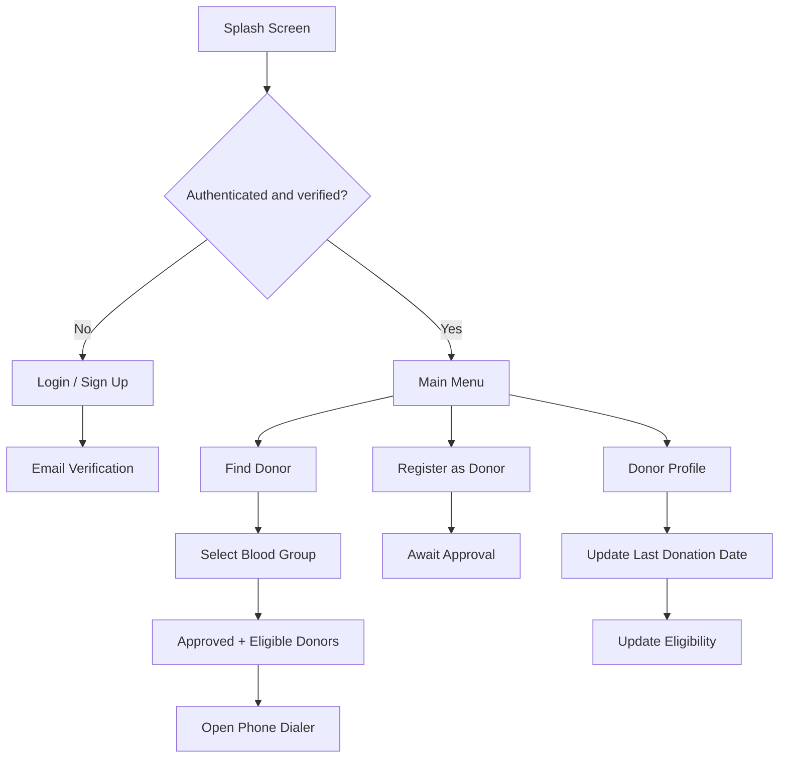

# IUT Blood Aid

An Android application for blood-donor registration, donor eligibility tracking, and blood-group-based donor discovery within the Islamic University of Technology (IUT) community.

## Overview

IUT Blood Aid was originally developed as an undergraduate Software Development course project. The app uses Firebase Authentication and Firebase Realtime Database to support account registration, email verification, donor registration, donor search, eligibility tracking, and direct donor contact through the Android phone dialer.

This repository preserves the original Java/XML implementation in Git history while restoring the project to a modern Android build structure so it can be inspected and built with current tooling.

## Features

- IUT email-based account registration
- Firebase Authentication
- Email verification
- Password reset
- Blood-donor registration
- Blood-group selection and search
- Donor approval status
- Donation eligibility tracking
- Filtering for approved and eligible donors
- RecyclerView-based search results
- Direct Android dialer integration
- Firebase Realtime Database persistence

## Tech Stack

- **Language:** Java
- **Platform:** Android
- **UI:** XML layouts, ConstraintLayout, RecyclerView
- **Authentication:** Firebase Authentication
- **Database:** Firebase Realtime Database
- **Build:** Gradle / Android Gradle Plugin
- **Compatibility:** AndroidX

## Application Flow



## Main Components

| Component | Responsibility |
| --- | --- |
| `Splash` | Determines whether the user should see login or the main application |
| `LoginActivity` | User sign-in and password reset |
| `SignUpActivity` | Account creation and email verification |
| `ChooseActivity` | Main navigation screen |
| `DonorReg` | Donor registration |
| `SearchActivity` | Blood-group selection |
| `ResultActivity` | Firebase donor lookup and eligibility filtering |
| `DonorAdapter` | RecyclerView rendering and dialer launch |
| `ProfileActivity` | Donation-date and eligibility management |
| `Donor` | Firebase donor data model |
| `WaitApproval` | Approval-status information |

## Firebase Data Model

The app uses two primary database branches.

### Users

```text
Users/
└── <uid>/
    ├── name
    ├── email
    └── donor
```

### Donors

```text
Donors/
└── <blood-group>/
    └── <donor-record>/
        ├── userId
        ├── email
        ├── name
        ├── sid
        ├── bg
        ├── phone
        ├── status
        └── eligibility
```

Search results include only donor records where:

```text
status = approved
eligibility = eligible
```

## Build Status

The restored project has been successfully compiled with a modern Android toolchain using:

- Android Gradle Plugin 9.4
- Gradle 9.6
- AndroidX dependencies
- Firebase Authentication
- Firebase Realtime Database

A Gradle wrapper is included, so the project can be built without installing Gradle globally.

## Running the Project

1. Clone the repository:

```bash
git clone git@github.com:mhrafi66/blood-aid-android.git
cd blood-aid-android
```

2. Create a Firebase project.

3. Register an Android app with package:

```text
io.github.mhrafi66.iutbloodaid
```

4. Enable:
   - Email/Password Authentication
   - Firebase Realtime Database

5. Download `google-services.json` and place it at:

```text
app/google-services.json
```

6. Build the app:

```bash
./gradlew assembleDebug
```

The Firebase configuration file is intentionally excluded from version control.

For more detail, see [`docs/FIREBASE_SETUP.md`](docs/FIREBASE_SETUP.md).

## Project Restoration

The original project history is intentionally preserved.

The tag:

```text
legacy-source
```

marks the untouched historical source state.

Later commits:

- restore the standard Android project structure,
- migrate obsolete Android support-library references to AndroidX,
- fix clear data-model and search bugs,
- add a modern Gradle wrapper,
- update the application package to `io.github.mhrafi66.iutbloodaid`,
- restore compatibility with current Android build tools,
- and add project documentation.

The restoration deliberately avoids rewriting the application into a completely different architecture. The original Java/XML design and Firebase-based workflow remain recognizable.

## Known Scope Limitations

- This repository contains the Android client only.
- The administrative workflow that changes donors from `unapproved` to `approved` is not included.
- The original Firebase backend and historical donor data are not distributed.
- The project was built as a student application, not as a production medical system.

A production deployment would require stronger authorization rules, privacy controls, donor consent handling, current medical eligibility guidance, and operational administration.

## Repository History

The first commits contain the original undergraduate project source. Later commits document the restoration and modernization work.

Useful tags:

- `legacy-source` — untouched historical source
- `portfolio-restoration-v1` — restored portfolio version

## License

No open-source license has been assigned to this historical student project.
