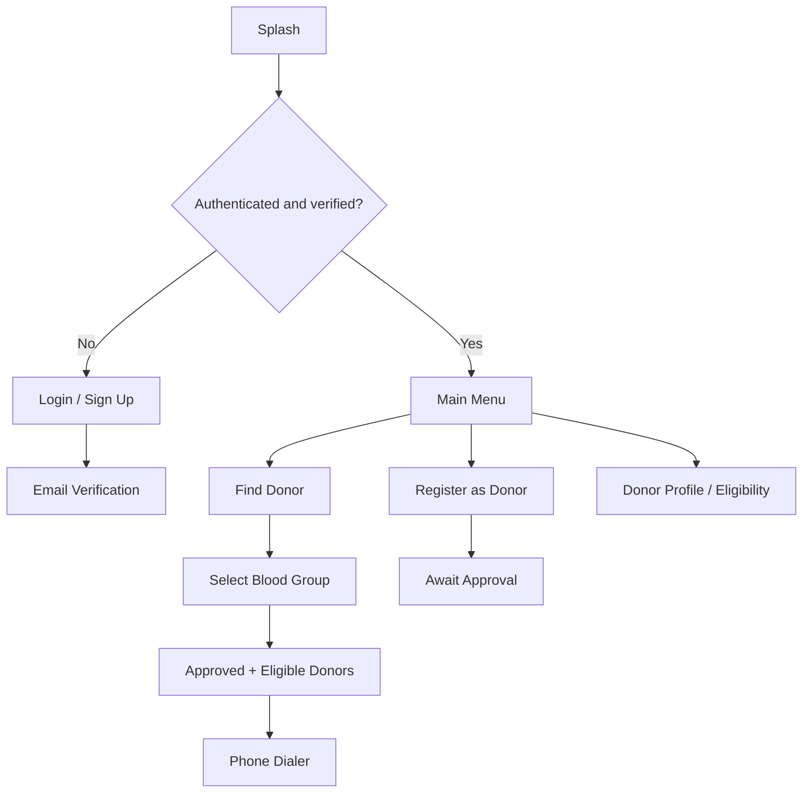

# IUT Blood Aid

Android application for blood-donor registration and blood-group-based donor discovery within the Islamic University of Technology (IUT) community.

## Overview

IUT Blood Aid was originally developed as an undergraduate Software Development course project.

The application uses Firebase Authentication and Firebase Realtime Database to support user registration, email verification, donor registration, donor eligibility tracking, blood-group-based donor search, and direct donor contact through the Android phone dialer.

The original Java/XML implementation is preserved in this repository's Git history under the `legacy-source` tag. Later commits restore the missing Android project structure, fix clear correctness issues, and document the project without replacing it with a different modern application.

## Features

- IUT email-based user registration
- Firebase Authentication
- Email verification and password reset
- Blood-donor registration
- Eight blood-group categories
- Donor approval and eligibility status
- Search for approved, eligible donors by blood group
- RecyclerView-based donor results
- Direct Android phone-dialer integration
- Firebase Realtime Database persistence

## Technology

- Java
- Android SDK
- XML layouts
- AndroidX
- ConstraintLayout
- RecyclerView
- Firebase Authentication
- Firebase Realtime Database
- Gradle

## Application Flow



## Main Components

| Component | Responsibility |
| --- | --- |
| `Splash` | Startup/authentication routing |
| `LoginActivity` | Sign in and password reset |
| `SignUpActivity` | Account creation and email verification |
| `ChooseActivity` | Main navigation |
| `DonorReg` | Donor registration |
| `SearchActivity` | Blood-group selection |
| `ResultActivity` | Firebase donor lookup and filtering |
| `DonorAdapter` | Donor result rendering and dialer launch |
| `ProfileActivity` | Donation-date and eligibility management |
| `Donor` | Firebase donor data model |
| `WaitApproval` | Donor approval information |

## Firebase Data Model

```text
Users/
└── <uid>/
    ├── name
    ├── email
    └── donor

Donors/
└── <blood-group>/
    └── <record>/
        ├── userId
        ├── email
        ├── name
        ├── sid
        ├── bg
        ├── phone
        ├── status
        └── eligibility
```

Search results include donor records with `status = approved` and `eligibility = eligible`.

## Running the Project

The historical Firebase backend configuration is intentionally not included.

Create your own Firebase project and follow [`docs/FIREBASE_SETUP.md`](docs/FIREBASE_SETUP.md).

Place the Firebase configuration at:

```text
app/google-services.json
```

That file is ignored by Git.

## Historical Source

The untouched source snapshot is tagged `legacy-source`.

The restoration preserves the original project concept and UI rather than rewriting it into a new architecture.

## Known Scope Limitation

This repository contains the Android client. The administrative workflow that changes donor status from `unapproved` to `approved` is not included.

A real production donor system would additionally require current medical eligibility rules, appropriate privacy/consent handling, and secure Firebase authorization rules.

## License

No open-source license has been assigned to this historical student project.
